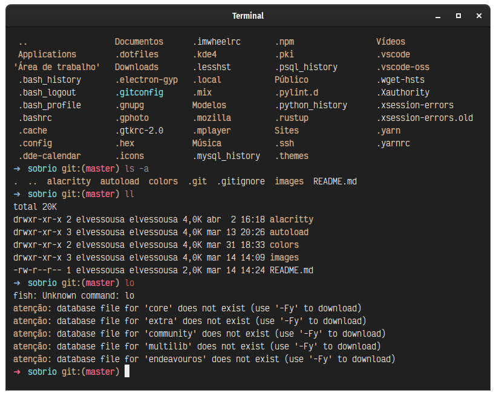

# Sobrio theme

_Typical Alacritty screen using this theme_

## About this theme

This is a theme for Alacritty, the terminal emulator. It uses the colors from the Sobrio theme to make your experience more unique.

## Installation

The "installation" process is quite simple. With the code above, just follow these four simple steps:

1. Copy the contents of the code you just saw to your `alacritty.yml`, usually found in `~/.config/alacritty/alacritty.yml`.
2. Save the file.
3. ???
4. Profit!
